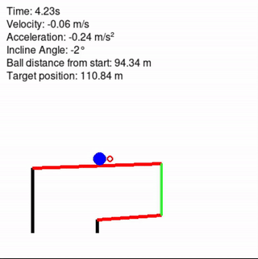
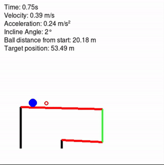

# PPO Control Task: PCGA Environment

This project implements a Proximal Policy Optimization (PPO) reinforcement learning agent to control a Pendulum-Controlled Gravity Apparatus (PCGA) environment. The goal is to train an agent that can position a ball at a target distance on a rotating stick by adjusting the stick's angle.

## 🎯 Project Overview

The PCGA environment simulates a physics-based control problem where:
- A ball rolls on a rotating stick mounted on a vertical support
- The agent controls the angle of rotation to move the ball
- The objective is to position the ball at a randomly assigned target position
- The agent must balance between reaching the target and maintaining the ball's stability

## 🎬 Demonstrations

### Training Process


The training process shows the agent learning to control the ball position over 1 million timesteps. The agent progressively improves its ability to reach target positions and maintain stability.

### Testing Performance


The testing phase demonstrates the trained agent's capability to accurately position the ball at various target locations, showcasing the learned control policy.

## 🔧 Features

- **Custom Gymnasium Environment**: Full implementation of the PCGA physics simulation
- **PPO Algorithm**: State-of-the-art reinforcement learning using Stable-Baselines3
- **Real-time Visualization**: PyGame-based rendering showing ball movement, velocity, and target position
- **Physics Simulation**: Realistic ball dynamics including gravity, friction, and angular motion
- **Configurable Hyperparameters**: Easily adjustable training parameters

## 📋 Environment Details

### Observation Space
The agent observes:
- Ball distance from start (0-200)
- Target position (0-200)
- Ball velocity (-100 to 100)
- Stick angle (84° to 96°)

### Action Space
Three discrete actions:
- **0**: Increase angle
- **1**: Decrease angle
- **2**: Do nothing (maintain current angle)

### Reward Function
The reward is designed to:
- Give high rewards when the ball reaches the target with low velocity
- Penalize moving away from the target
- Provide -100 penalty if the ball falls off the stick
- Encourage stopping at the target position

## 🚀 Installation

### Requirements
```bash
pip install stable-baselines3
pip install gymnasium
pip install pygame
pip install numpy
```

### Dependencies
- Python 3.7+
- stable-baselines3
- gymnasium
- pygame
- numpy

## 💻 Usage

### Training
To train a new PPO agent:
```bash
python train.py
```

Training parameters:
- Total timesteps: 1,000,000
- Learning rate: 1e-3
- Network architecture: [64, 64]
- Batch size: 256
- Entropy coefficient: 0.03

### Testing
To test the trained model:
```bash
python test.py
```

The test script loads the pre-trained model and demonstrates its performance with visualization enabled.

## 📊 Model Performance

The trained model (`ppo_pcga_1M_steps32x32_random_improved.zip`) achieves:
- Consistent target reaching capability
- Smooth control transitions
- Robust performance across different target positions
- Effective velocity management near the target

**Note**: The model filename contains '32x32' referring to an earlier architecture version. The current recommended training configuration uses a [64, 64] network architecture as specified in `train.py`.

## 🎮 Environment Physics

The PCGA environment includes:
- **Gravity**: 9.8 (simulation units/s²)
- **Ball radius**: 10 (simulation units)
- **Stick length**: 200 (simulation units for primary stick)
- **Angle range**: Dynamically calculated based on secondary stick rotation
- **Friction**: Applied when the stick is horizontal (90°)
- **Time step**: 1/60 seconds (60 FPS)

**Note**: The environment uses dimensionless simulation units for spatial measurements, while time is measured in seconds.

## 📝 Files Description

- `Pcga_env.py`: Custom Gymnasium environment implementation
- `train.py`: Training script with PPO configuration
- `test.py`: Testing script for model evaluation
- `train.gif`: Visualization of the training process
- `test.gif`: Visualization of the testing performance
- `ppo_pcga_1M_steps32x32_random_improved.zip`: Pre-trained model weights

## 🙏 Acknowledgments

This project uses:
- [Stable-Baselines3](https://github.com/DLR-RM/stable-baselines3) for PPO implementation
- [Gymnasium](https://gymnasium.farama.org/) for environment interface
- [PyGame](https://www.pygame.org/) for visualization

## 📄 License

This project is open source and available for educational and research purposes.
